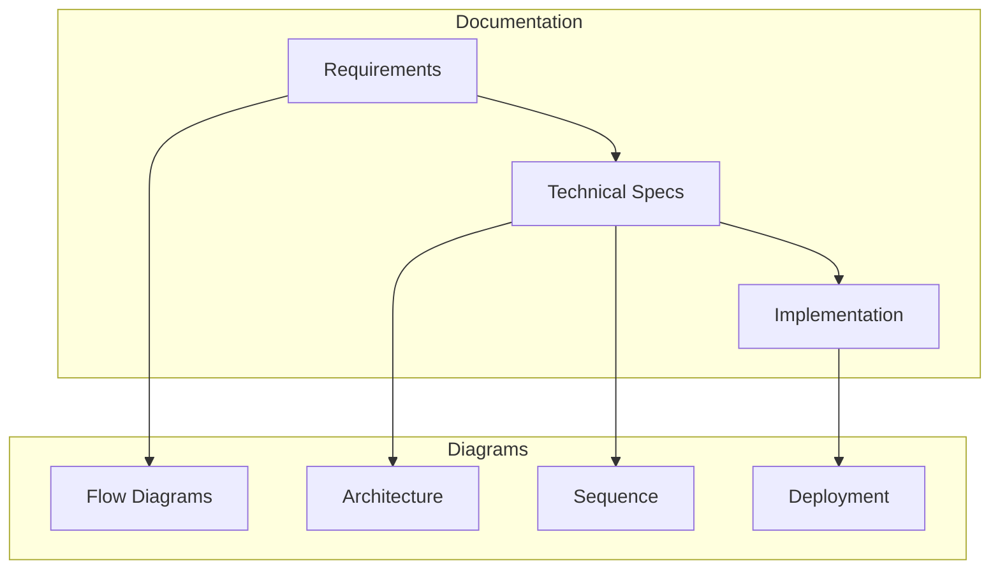

# Spec First Playbook

A comprehensive framework for AI-first development, providing a structured approach to collaboration between human developers and AI agents. This project implements and demonstrates the spec-first development methodology, focusing on clear specifications and AI-driven development processes.

## 🎯 Project Goals

- Establish a standard for spec-first development practices
- Enable efficient AI-human collaboration in software development
- Provide structured workflows for AI-assisted development
- Maintain high-quality documentation and code standards
- Create reproducible spec-first development patterns
- Ensure clear visual documentation through diagrams

## 🚀 Getting Started

### For Developers

1. **Setup & Documentation**
   - Read [Quick Start Guide](documentation/guides/developer/quick-start.md) for initial setup
   - Follow [Spec-First Workflow](documentation/guides/developer/spec-first-workflow.md) for detailed process
   - Review [Contributing Guidelines](CONTRIBUTING.md)
   - Check [Generator Usage Guide](documentation/guides/developer/generator_usage.md) for documentation generation

2. **Development Environment**
   - Set up your AI agent with our [System Prompt](SYSTEM_PROMPT.md)
   - Follow spec-first development practices
   - Use the provided documentation generators
   - Ensure Mermaid diagram support in your environment

### For AI Agents

1. **Core Guidelines**
   - Read [Spec-First Agent Guide](documentation/guides/ai/spec-first-agent-guide.md)
   - Follow the Confirmation Protocol
   - Validate all changes
   - Generate required diagrams

2. **Documentation Structure**
   - Base documentation in `documentation/base/`
   - Generated content in `documentation/generated/`
   - Follow naming conventions in contributing guidelines
   - Maintain diagram consistency

## 📚 Project Documentation

- [Product Requirements (PRD)](documentation/base/prd.md)
- [Database Schema](documentation/base/db_schema.md)
- [Technical Specifications](documentation/generated/technical/)
- [Implementation Guides](documentation/generated/prompts/)
- Visual Documentation:
  - Architecture Diagrams
  - Flow Diagrams
  - Sequence Diagrams
  - Deployment Diagrams

## 🔄 Development Process

We use AI agents for development. For all changes:
1. Update documentation first
2. Let AI agents validate changes
3. Follow the Confirmation Protocol
4. Keep documentation in sync
5. Maintain visual documentation

For detailed workflow, see [Spec-First Workflow](documentation/guides/developer/spec-first-workflow.md).

## 🛠 Project Structure

```
.
├── CONTRIBUTING.md     # Contribution guidelines
├── LICENSE            # MIT license
├── SYSTEM_PROMPT.md   # AI agent system prompt
└── documentation/
    ├── base/         # Core project documentation
    ├── guides/       # Developer and AI guides
    │   ├── developer/  # Developer-focused guides
    │   └── ai/        # AI agent guides
    ├── templates/    # Documentation templates
    ├── generators/   # Documentation generators
    │   ├── create_requirements_prompt.md
    │   ├── create_technical_prompt.md
    │   └── create_prompts_prompt.md
    ├── evals/       # Evaluation system
    └── generated/   # Generated documentation
        ├── requirements/
        │   ├── use_cases/
        │   ├── matrices/
        │   └── diagrams/
        ├── technical/
        │   ├── specs/
        │   └── diagrams/
        └── prompts/
            ├── implementation/
            └── diagrams/
```

## 📊 Diagram Support

The project uses Mermaid diagrams for visual documentation:



### Diagram Types
- Flow Diagrams (User Journeys, Processes)
- Architecture Diagrams (System, Components)
- Sequence Diagrams (Interactions)
- Deployment Diagrams (Infrastructure)

## 🤝 Contributing

We welcome contributions! Please see our [Contributing Guidelines](CONTRIBUTING.md) for details on:
- Code of Conduct
- Development process
- Pull request process
- Documentation standards
- Diagram standards

## 📄 License

This project is licensed under the MIT License - see the [LICENSE](LICENSE) file for details.

## 🙏 Acknowledgments

- All contributors who help make this project better
- The AI/ML community for pushing the boundaries of developer tooling
