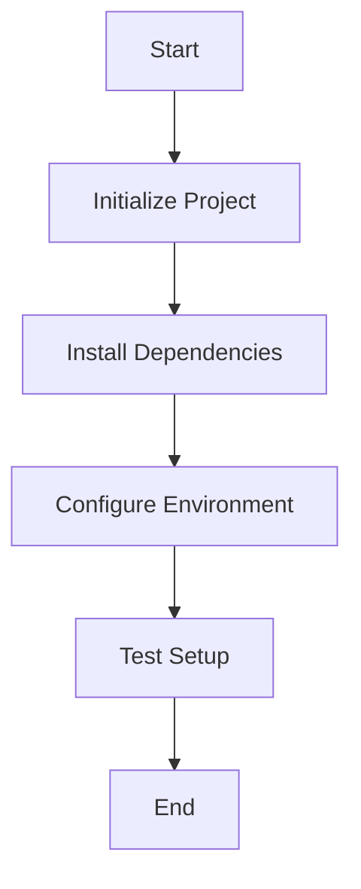
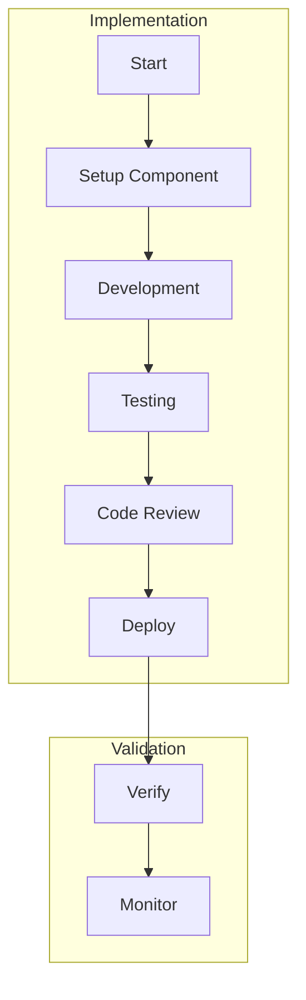
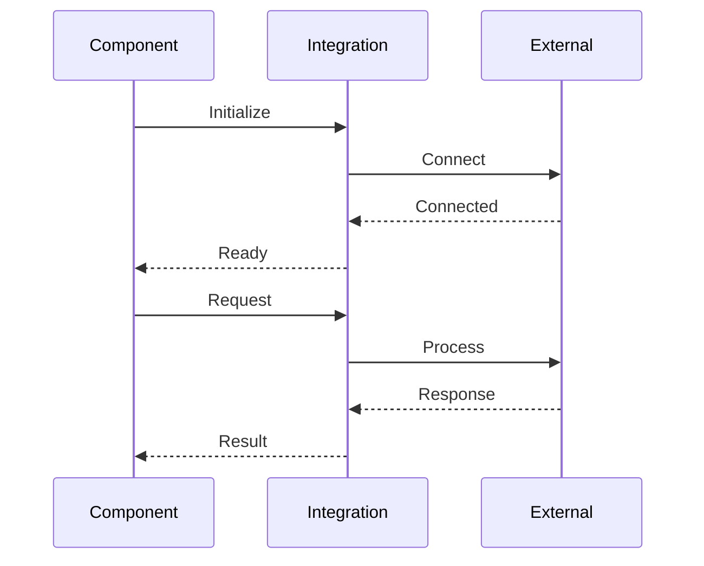

# Implementation Prompts Generator

---
generator_config:
  name: "implementation-prompts-generator"
  version: "1.0.0"
  description: "Generates implementation prompts from requirements and technical specifications"
  
  input:
    sources:
      - path: "documentation/generated/requirements"
        required: true
        type: "requirements"
      - path: "documentation/generated/technical"
        required: true
        type: "specifications"
        
  output:
    base_path: "documentation/generated/prompts"
    structure:
      implementation:
        path: "implementation"
        subdirectories:
          - "setup"
          - "frontend"
          - "backend"
          - "database"
          - "testing"
          - "deployment"
      diagrams:
        path: "diagrams"
        subdirectories:
          - "setup"           # Setup and initialization flows
          - "implementation"  # Implementation flows
          - "deployment"      # Deployment flows
        files:
          - "setup_flow.md"
          - "implementation_flow.md"
          - "deployment_flow.md"
      metadata_file: "metadata.json"
      tracking_file: "implementation.json"
        
  metadata:
    template:
      generated_by: "create_prompts_prompt.md"
      version: "1.0.0"
      timestamp: "TIMESTAMP"
      based_on:
        requirements_version: "1.0.0"
        technical_specs_version: "1.0.0"
        
  validation:
    required_sections:
      - "Context"
      - "Implementation Scope"
      - "Requirements"
      - "Implementation Steps"
      - "Validation Criteria"
    naming_convention:
      prompt_files: "PROMPT-{number}_{type}_{description}.md"
    
  tracking:
    status_values:
      - "Pending"
      - "In Progress"
      - "Completed"
      - "Blocked"
    required_metadata:
      - "started_at"
      - "completed_at"
      - "dependencies"
      - "blocked_by"
    
  execution:
    order:
      - "setup/*"
      - "implementation/database/*"
      - "implementation/backend/*"
      - "implementation/frontend/*"
      - "testing/*"
      - "deployment/*"
    parallel_execution:
      allowed: true
      rules:
        - "frontend can parallel with backend after database"
        - "testing requires implementation"
        - "deployment requires testing"
---

## Objective
Generate structured implementation prompts from requirements and technical specifications.

## Input Sources
1. Requirements (`documentation/generated/requirements/`)
2. Technical Specifications (`documentation/generated/technical/`)

## Output Location
The generator should create the following structure:
```
documentation/
└── generated/
    ├── prompts/
    │   ├── setup/              # Project setup prompts
    │   ├── implementation/     # Feature implementation prompts
    │   │   ├── frontend/       # Frontend-specific prompts
    │   │   ├── backend/        # Backend-specific prompts
    │   │   └── database/       # Database-specific prompts
    │   ├── testing/            # Test implementation prompts
    │   ├── deployment/         # Deployment-related prompts
    │   └── metadata.json       # Generation metadata
    └── tracking/
        └── implementation.json # Implementation tracking data
```

## Metadata Structure
Each generated prompt should include:
```yaml
---
generated_by: create_prompts_prompt.md
version: 1.0.0
generated_at: TIMESTAMP
based_on:
  requirements: v1.0.0
  technical_specs: v1.0.0
dependencies:
  use_cases: ["UC-001", "UC-002"]
  technical_specs: ["auth-flow", "api-structure"]
---
```

## Prompt Template
```markdown
# Implementation Prompt: [Title]

## Metadata
[Include standard metadata block]

## Context
- **Related Use Cases:** [List of UC references]
- **Technical Specs:** [List of spec references]
- **Dependencies:** [List of dependent prompts]

## Implementation Scope
- **Components:** [Affected system components]
- **Files:** [Files to be created/modified]
- **APIs:** [Related API endpoints]

## Requirements
- **Functional:** [Functional requirements]
- **Technical:** [Technical requirements]
- **Security:** [Security requirements]
- **Performance:** [Performance requirements]

## Implementation Steps
1. [Detailed step-by-step instructions]

## Validation Criteria
1. [List of validation points]

## Error Handling
- [Error scenarios and handling]

## Testing Requirements
- **Unit Tests:** [Required tests]
- **Integration Tests:** [Required tests]
- **E2E Tests:** [Required tests]

## Dependencies Update
- [Instructions for updating dependent systems]

## Rollback Plan
- [Steps for rolling back changes]
```

## Tracking Structure
```json
{
  "metadata": {
    "last_generated": "TIMESTAMP",
    "version": "1.0.0"
  },
  "statistics": {
    "total_prompts": 0,
    "by_type": {
      "setup": 0,
      "frontend": 0,
      "backend": 0,
      "database": 0,
      "testing": 0,
      "deployment": 0
    }
  },
  "prompts": [
    {
      "id": "PROMPT-001",
      "title": "",
      "type": "",
      "status": "pending",
      "dependencies": [],
      "use_cases": [],
      "technical_specs": []
    }
  ]
}
```

## Generation Process

1. Initial Setup
   - Create output directory structure
   - Initialize tracking files
   - Set up metadata templates

2. Requirements Analysis
   - Parse use cases
   - Review technical specs
   - Map dependencies
   - Identify implementation order

3. Prompt Generation
   - Generate setup prompts
   - Create implementation prompts
   - Generate test prompts
   - Create deployment prompts

4. Validation
   - Verify completeness
   - Check dependencies
   - Validate references
   - Ensure coverage

## Success Criteria

1. Completeness
   - All use cases covered
   - All technical specs addressed
   - All dependencies mapped
   - All validation criteria defined

2. Quality
   - Clear instructions
   - Complete context
   - Valid references
   - Proper error handling

3. Traceability
   - Links to requirements
   - Links to technical specs
   - Clear dependency chains
   - Implementation tracking

## Usage Instructions

1. Run this prompt to generate implementation prompts:
   ```bash
   # The AI will:
   - Create the prompts directory structure
   - Generate all prompt files
   - Create tracking documents
   - Validate dependencies
   ```

2. Review generated content:
   - Verify structure
   - Check completeness
   - Validate relationships
   - Review tracking data

3. Use prompts for:
   - Implementation guidance
   - Testing requirements
   - Deployment steps
   - Progress tracking

## Next Steps

1. Implementation
   - Follow prompt sequence
   - Track progress
   - Update dependencies
   - Validate results

2. Testing
   - Execute test plans
   - Validate implementations
   - Update tracking

3. Deployment
   - Follow deployment prompts
   - Validate deployments
   - Update status

## Note
Implementation prompts should be treated as living documents, updated as the implementation progresses and new requirements or technical considerations are discovered. 

## Diagram Templates

### Setup Flow Diagram
```markdown
# Setup Flow: [Flow Name]

## Metadata
[Include standard metadata block]

## Flow Diagram


## Steps
1. [Step description]
2. [Step description]

## Requirements
- [Requirement 1]
- [Requirement 2]

## Validation
1. [Validation step]
2. [Validation step]
```

### Implementation Flow Diagram
```markdown
# Implementation Flow: [Component Name]

## Metadata
[Include standard metadata block]

## Flow Diagram


## Phases
1. Setup
   - [Description]
   - [Requirements]

2. Development
   - [Description]
   - [Guidelines]

3. Testing
   - [Description]
   - [Test cases]

## Validation
1. [Validation step]
2. [Validation step]
```

### Deployment Flow Diagram
```markdown
# Deployment Flow: [Environment]

## Metadata
[Include standard metadata block]

## Flow Diagram
```mermaid
graph TD
    subgraph Build
        Code[Code] --> Test[Test]
        Test --> Build[Build]
    end
    
    subgraph Deploy
        Build --> Stage[Staging]
        Stage --> Verify[Verify]
        Verify --> Prod[Production]
    end
    
    subgraph Monitor
        Prod --> Log[Logging]
        Prod --> Metric[Metrics]
        Prod --> Alert[Alerts]
    end
```

## Phases
1. Build Phase
   - [Description]
   - [Steps]

2. Deploy Phase
   - [Description]
   - [Steps]

3. Monitor Phase
   - [Description]
   - [Steps]

## Rollback
1. [Rollback step]
2. [Rollback step]
```

### Integration Flow Diagram
```markdown
# Integration Flow: [Integration Name]

## Metadata
[Include standard metadata block]

## Flow Diagram


## Steps
1. [Step description]
2. [Step description]

## Error Handling
1. [Error scenario]
2. [Error scenario]

## Validation
1. [Validation step]
2. [Validation step]
``` 