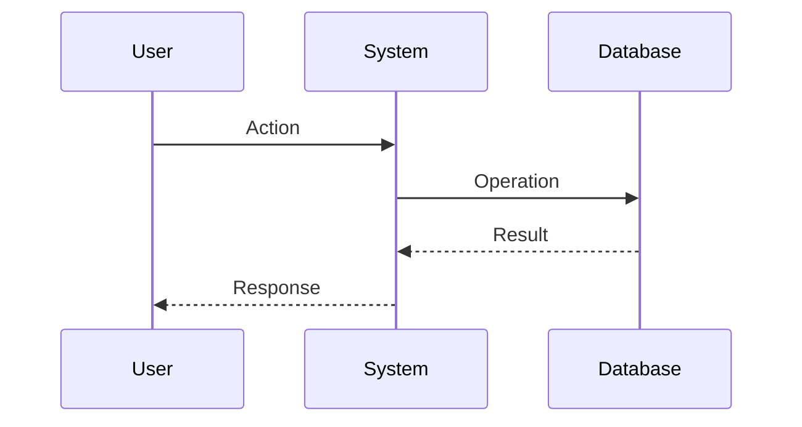
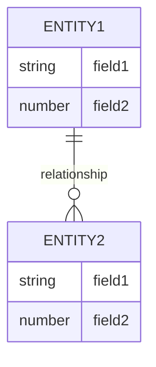
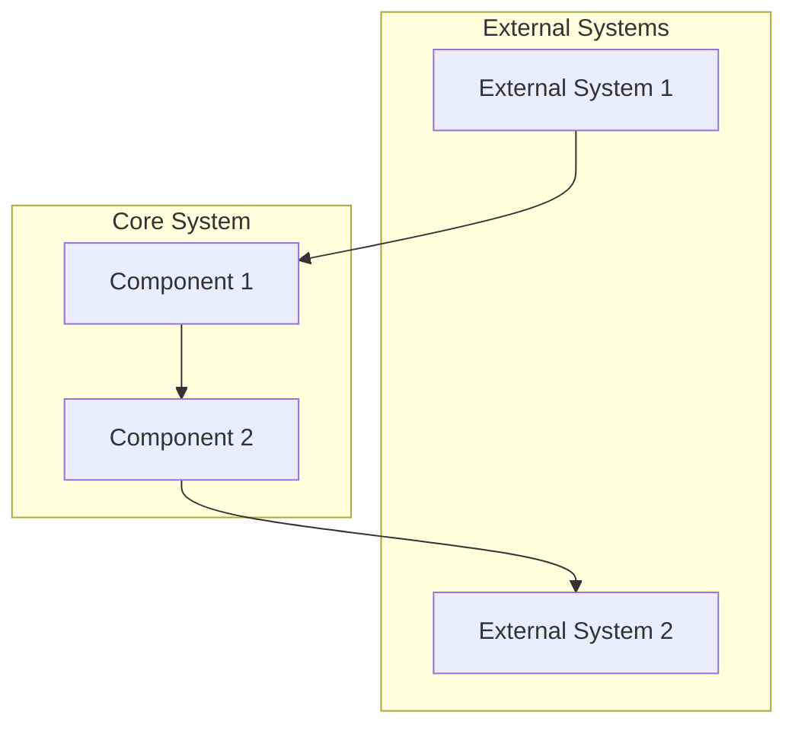

# Requirements Generator Prompt

---
generator_config:
  name: "requirements-generator"
  version: "1.0.0"
  description: "Generates use cases and requirements documentation from base documents"
  
  input:
    sources:
      - path: "documentation/base/*.md"
        required: true
        type: "base_documentation"
        
  output:
    base_path: "documentation/generated/requirements"
    structure:
      use_cases:
        path: "use_cases"
        subdirectories:
          - "user"
          - "admin"
          - "system"
      diagrams:
        path: "diagrams"
        subdirectories:
          - "flows"          # User journey and process flows
          - "entities"       # Entity relationship diagrams
          - "context"        # System context diagrams
        files:
          - "user_flows.md"
          - "entity_relationships.md"
          - "system_context.md"
      matrices:
        path: "matrices"
        files:
          - "feature-matrix.md"
          - "database-matrix.md"
      metadata_file: "metadata.json"
      tracking_file: "requirements.json"
        
  metadata:
    template:
      generated_by: "create_requirements_prompt.md"
      version: "1.0.0"
      timestamp: "TIMESTAMP"
      based_on:
        base_docs_version: "1.0.0"
        
  validation:
    required_sections:
      - "Overview"
      - "Dependencies"
      - "Description"
      - "Preconditions"
      - "Main Flow"
    naming_convention:
      use_case_files: "UC-{number}_{type}_{description}.md"
      diagram_files: "{use_case_id}_{diagram_type}.md"
    
  tracking:
    status_values:
      - "Not Started"
      - "In Progress"
      - "Completed"
    required_metadata:
      - "started_at"
      - "completed_at"
      - "dependencies"
---

## Objective
Generate comprehensive use cases and requirements documentation from the project's core requirements.

## Input Sources
1. Product Requirements Document (`documentation/base/PRD.md`)
2. Database Schema (`documentation/base/db_v1.md`)

## Output Location
The generator should create the following structure:
```
documentation/
└── generated/
    ├── requirements/
    │   ├── use_cases/           # Individual use case files
    │   │   ├── user/            # User-focused use cases
    │   │   ├── admin/           # Admin-focused use cases
    │   │   └── system/          # System-focused use cases
    │   ├── diagrams/            # User flow diagrams
    │   ├── matrices/            # Requirements traceability
    │   │   ├── feature-matrix.md    # Feature coverage
    │   │   └── database-matrix.md   # Data requirements
    │   └── metadata.json        # Generation metadata
    └── tracking/
        └── requirements.json    # Requirements tracking data
```

## Metadata Structure
Each generated file should include:
```yaml
---
generated_by: create_requirements_prompt.md
version: 1.0.0
generated_at: TIMESTAMP
based_on:
  prd: v1.0.0
  db_schema: v1.0.0
coverage:
  features: ["feature1", "feature2"]
  entities: ["entity1", "entity2"]
---
```

## Use Case Template
```markdown
# Use Case: [Title]

## Metadata
[Include standard metadata block]

## Overview
- **ID:** UC-[Number]
- **Type:** [User|Admin|System]
- **Feature:** [Feature Name]
- **Priority:** [High|Medium|Low]
- **Actor:** [Primary Actor]

## Dependencies
- **Requires:** [List of required use cases]
- **Required By:** [List of dependent use cases]
- **Database Entities:** [List of related DB entities]

## Description
[Detailed description of the use case]

## Preconditions
1. [List of required conditions]

## Main Flow
1. [Step-by-step flow]

## Alternative Flows
1. [Alternative scenario descriptions]

## Error Scenarios
1. [Error handling descriptions]

## Postconditions
1. [List of resulting conditions]

## Technical Notes
- **API Endpoints:** [Required endpoints]
- **Database Operations:** [Required DB operations]
- **Security Requirements:** [Security considerations]

## Validation Criteria
1. [List of validation points]

## Related Documents
- [Links to related specifications]
```

## Diagram Templates

### User Flow Diagram
```markdown
# User Flow: [Flow Name]

## Metadata
[Include standard metadata block]

## Flow Diagram


## Description
[Flow description]

## Steps
1. [Step description]
2. [Step description]

## Notes
- [Additional notes]
```

### Entity Relationship Diagram
```markdown
# Entity Relationships: [Domain]

## Metadata
[Include standard metadata block]

## Diagram


## Entities
1. Entity1
   - Field1: [Description]
   - Field2: [Description]

2. Entity2
   - Field1: [Description]
   - Field2: [Description]

## Relationships
- Entity1 to Entity2: [Description]
```

### System Context Diagram
```markdown
# System Context: [System Name]

## Metadata
[Include standard metadata block]

## Diagram


## Components
1. External Systems
   - System1: [Description]
   - System2: [Description]

2. Core System
   - Component1: [Description]
   - Component2: [Description]

## Interactions
1. [Interaction description]
2. [Interaction description]
```

## Generation Process

1. Initial Setup
   - Create output directory structure
   - Initialize tracking files
   - Set up metadata templates

2. Requirements Analysis
   - Parse PRD for features
   - Extract user roles
   - Identify system requirements
   - Map database dependencies

3. Use Case Generation
   - Generate use cases by type
   - Create flow diagrams
   - Establish dependencies
   - Validate completeness

4. Matrix Generation
   - Create feature coverage matrix
   - Generate database usage matrix
   - Validate requirement coverage
   - Identify gaps

## Tracking Structure

```json
{
  "metadata": {
    "last_generated": "TIMESTAMP",
    "version": "1.0.0"
  },
  "statistics": {
    "total_use_cases": 0,
    "by_type": {
      "user": 0,
      "admin": 0,
      "system": 0
    },
    "coverage": {
      "features": 0,
      "database_entities": 0
    }
  },
  "use_cases": [
    {
      "id": "UC-001",
      "title": "",
      "type": "",
      "status": "pending",
      "dependencies": [],
      "dependents": []
    }
  ]
}
```

## Validation Steps

1. Structure Validation
   - Verify directory structure
   - Check file naming conventions
   - Validate metadata blocks
   - Ensure no broken links

2. Content Validation
   - Verify feature coverage
   - Check database entity usage
   - Validate dependencies
   - Ensure completeness

3. Cross-Reference Validation
   - Check PRD references
   - Verify DB schema references
   - Validate use case dependencies
   - Check technical references

## Success Criteria

1. Completeness
   - All features covered
   - All roles represented
   - All entities referenced
   - All dependencies mapped

2. Quality
   - No orphaned use cases
   - No circular dependencies
   - Complete metadata
   - Valid cross-references

3. Traceability
   - Feature to use case mapping
   - Database to use case mapping
   - Dependency chains clear
   - Implementation status trackable

## Usage Instructions

1. Run this prompt to generate requirements:
   ```bash
   # The AI will:
   - Create the requirements directory structure
   - Generate all use case files
   - Create tracking documents
   - Generate matrices
   ```

2. Review generated content:
   - Verify structure
   - Check completeness
   - Validate relationships
   - Review matrices

3. Use requirements for:
   - Technical specification input
   - Implementation planning
   - Test case development
   - Progress tracking

## Next Steps

1. Technical Specifications
   - Use as input for technical specs
   - Map requirements to components
   - Define technical constraints

2. Implementation Planning
   - Create development tasks
   - Set priorities
   - Define milestones

3. Validation Planning
   - Define test scenarios
   - Create acceptance criteria
   - Plan user testing

## Note
Requirements documentation should be treated as a living document, updated as the project evolves and new requirements are discovered or existing ones are modified.
