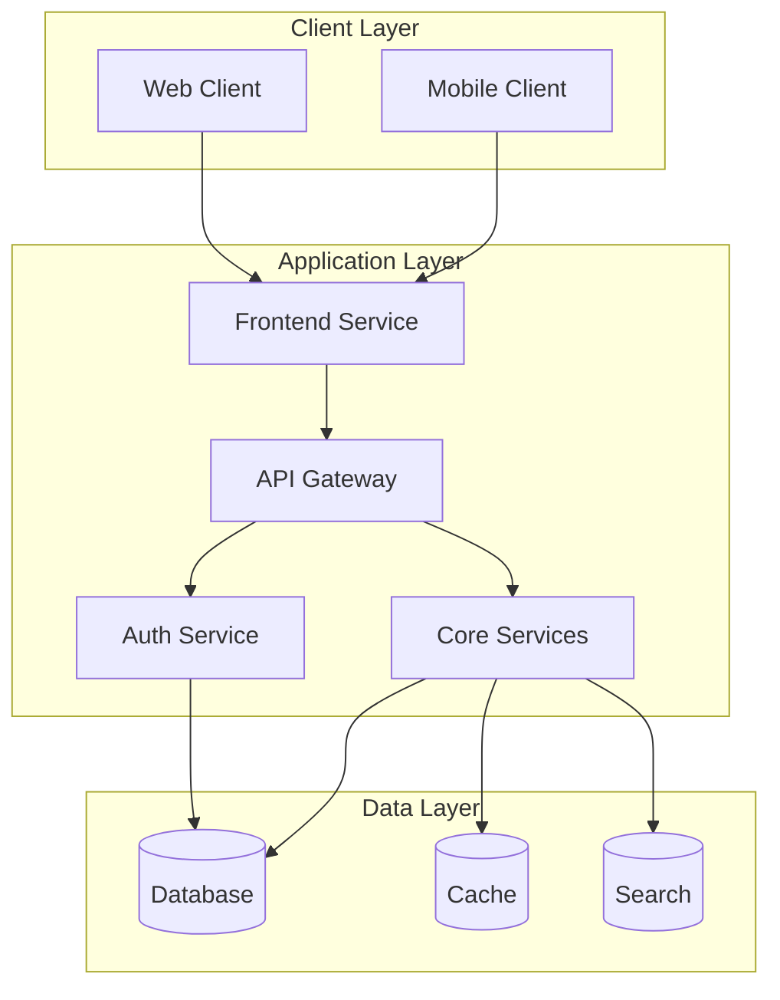
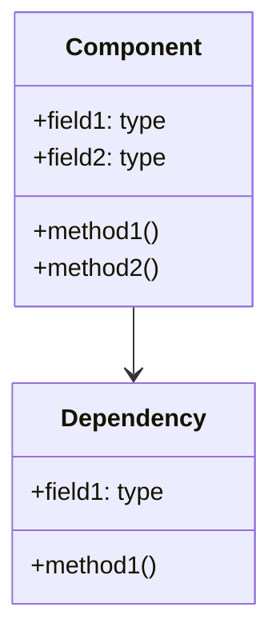
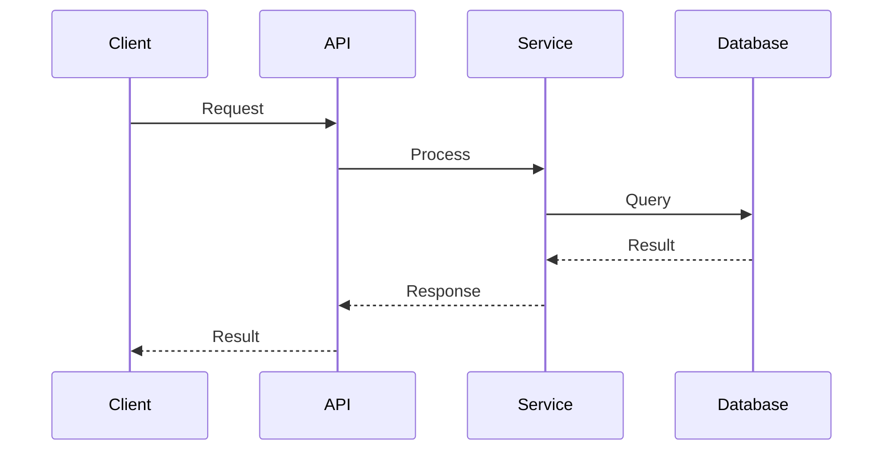
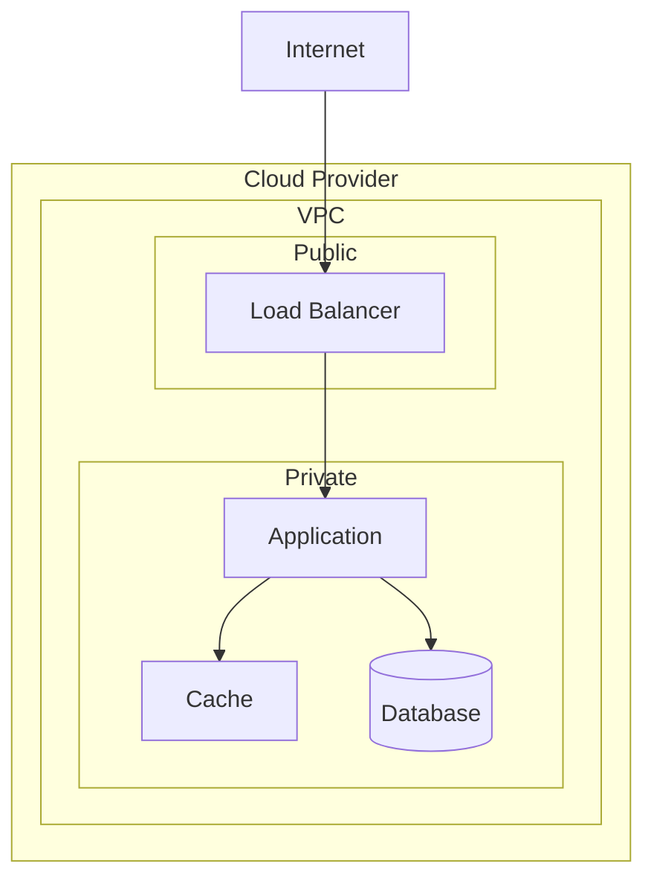

# Create Technical Specifications Prompt

---
generator_metadata:
  name: "technical-specs-generator"
  version: "1.0.0"
  description: "Generates technical specifications from base documentation"
  
  input_sources:
    - path: "documentation/base/*.md"
      type: "base_documentation"
      required: true
      sections:
        - name: "Authentication Strategy"
          coverage: "full"
          outputs:
            - type: "technical_spec"
              path: "documentation/generated/technical/specs/security.md"
            - type: "diagram"
              path: "documentation/generated/technical/diagrams/auth-flow.md"
        - name: "User Personas"
          coverage: "full"
          outputs:
            - type: "technical_spec"
              path: "documentation/generated/technical/specs/frontend.md"
        - name: "Permissions & Access Control"
          coverage: "full"
          outputs:
            - type: "technical_spec"
              path: "documentation/generated/technical/specs/security.md"
        - name: "Key Features"
          coverage: "full"
          outputs:
            - type: "technical_spec"
              path: "documentation/generated/technical/specs/architecture.md"
        - name: "Technology Stack"
          coverage: "full"
          outputs:
            - type: "technical_spec"
              path: "documentation/generated/technical/specs/architecture.md"
            - type: "technical_spec"
              path: "documentation/generated/technical/specs/deployment.md"
        - name: "Database Schema"
          coverage: "full"
          outputs:
            - type: "technical_spec"
              path: "documentation/generated/technical/specs/database.md"
            - type: "diagram"
              path: "documentation/generated/technical/diagrams/er-diagram.md"
  
  output_mapping:
    - source_requirement:
        document: "*.md"
        section: "Authentication Strategy"
        requirement: "Device Pairing + PIN Login"
      output:
        type: "technical_spec"
        path: "specs/security.md"
        validation:
          - criteria: "Flow diagram present"
          - criteria: "Security considerations documented"
          - criteria: "Implementation details specified"
    - source_requirement:
        document: "*.md"
        section: "Authentication Strategy"
        requirement: "Device Pairing + PIN Login"
      output:
        base_path: "documentation/generated/technical"
        structure:
          specs:
            path: "specs"
            files:
              - "architecture.md"
              - "frontend.md"
              - "backend.md"
              - "database.md"
              - "security.md"
              - "deployment.md"
          diagrams:
            path: "diagrams"
            subdirectories:
              - "architecture"    # System and component architecture
              - "sequences"       # Sequence diagrams for key flows
              - "deployment"      # Deployment and infrastructure
            files:
              - "system_architecture.md"
              - "component_architecture.md"
              - "data_flow.md"
              - "deployment_architecture.md"
          metadata_file: "metadata.json"
  
  coverage_tracking:
    requirements:
      total: 25
      functional: 12
      technical: 8
      user: 5
    sections:
      - name: "Authentication"
        coverage: 100
        gaps: []
      - name: "User Interface"
        coverage: 100
        gaps: []
      - name: "Database"
        coverage: 100
        gaps: []
      - name: "Deployment"
        coverage: 100
        gaps: []
  
  dependencies:
    generators: []
    documents: ["*.md"]
    
  validation:
    required_sections:
      - "System Architecture"
      - "Frontend Implementation"
      - "Backend Implementation"
      - "Database Implementation"
      - "Security Implementation"
      - "Deployment Strategy"
    required_outputs:
      - "technical-specs.md"
      - "architecture.md"
      - "frontend.md"
      - "backend.md"
      - "database.md"
      - "security.md"
      - "deployment.md"
    validation_rules:
      - rule: "All diagrams must use mermaid syntax"
        severity: "error"
      - rule: "All security considerations must be documented"
        severity: "error"
      - rule: "All technical decisions must be justified"
        severity: "warning"
---

## Objective
Generate comprehensive technical specifications from all base documentation that can be used to create both requirements and implementation prompts.

## Input Sources
All markdown files in the base documentation directory (`documentation/base/*.md`)

## Output Location
The generator should create the following structure:
```
documentation/
└── generated/
    └── technical/
        ├── specs/
        │   ├── architecture.md     # System architecture details
        │   ├── frontend.md         # Frontend implementation specs
        │   ├── backend.md          # Backend implementation specs
        │   ├── database.md         # Database implementation specs
        │   ├── security.md         # Security implementation specs
        │   └── deployment.md       # Deployment and DevOps specs
        ├── diagrams/              # System and flow diagrams
        ├── api/                   # API specifications
        └── technical-specs.md     # Main technical specification document
```

## Expected Output Content
The main `technical_specs.md` file should include:

1. System Components
   - Frontend applications structure
   - Backend services organization
   - Database implementation details
   - Infrastructure setup

2. Implementation Guidelines
   - Coding standards
   - Project structure
   - Testing requirements
   - Security implementations

3. Technical Requirements Matrix
   - Feature breakdown
   - Dependencies
   - Technical constraints
   - Performance requirements

## Analysis Instructions

1. PRD Analysis
   ```markdown
   For each section in PRD.md:
   - Extract technical implications
   - Identify implementation requirements
   - Note architectural decisions
   - List potential technical challenges
   ```

2. Database Analysis
   ```markdown
   For each entity in db_v1.md:
   - Define implementation approach
   - Identify indexing requirements
   - Note relationships complexity
   - List required migrations
   ```

3. Stack-Specific Requirements
   ```markdown
   For each technology in stack:
   - Document best practices
   - List required configurations
   - Note integration points
   - Identify optimization opportunities
   ```

## Technical Specifications Structure

The generated `technical_specs.md` should follow this structure:

```markdown
# Technical Specifications

## 1. System Architecture
- Component diagram
- Data flow
- Service boundaries
- Integration points

## 2. Frontend Implementation
- Application structure
- State management
- Component hierarchy
- PWA requirements

## 3. Backend Implementation
- API structure
- Service organization
- Authentication flow
- Authorization implementation

## 4. Database Implementation
- Schema implementation
- Migration strategy
- Indexing plan
- Performance optimization

## 5. Development Guidelines
- Code organization
- Naming conventions
- Testing approach
- Documentation requirements

## 6. Security Implementation
- Authentication methods
- Authorization flow
- Data protection
- Security best practices

## 7. Deployment Strategy
- Environment setup
- CI/CD pipeline
- Monitoring setup
- Backup procedures

## 8. Performance Requirements
- Load time targets
- API response times
- Database query optimization
- Caching strategy
```

## Generation Process

1. Initial Analysis
   - Read PRD.md and extract technical requirements
   - Analyze db_v1.md for implementation details
   - Identify technical constraints and dependencies
   - Create the output directory structure if it doesn't exist

2. Component Breakdown
   - List all system components
   - Define component interactions
   - Document API contracts
   - Specify data flows
   - Generate individual specification files in appropriate directories

## File Organization Rules

1. Main Technical Specs
   - Place `technical_specs.md` in the root of technical/
   - Use relative links to reference detailed specs

2. Detailed Specifications
   - Place component-specific specs in technical/specs/
   - Use consistent naming conventions
   - Include section cross-references

3. Diagrams
   - Store all diagrams in technical/diagrams/
   - Use mermaid for version-controlled diagrams
   - Reference diagrams using relative paths

4. API Specifications
   - Place API docs in technical/api/
   - Follow OpenAPI 3.0 specification
   - Include examples and schemas

## Version Control Guidelines

1. File Naming
   - Use lowercase with hyphens
   - Include component prefix (e.g., frontend-auth-flow.md)
   - Version sensitive documents (e.g., api-v1.yaml)

2. Updates
   - Maintain a change log section in each document
   - Use semantic versioning for API specs
   - Document breaking changes clearly

## Cross-Reference Guidelines

1. Between Documents
   - Use relative paths for links
   - Include section anchors when linking
   - Maintain bidirectional references

2. With Requirements
   - Link to relevant sections in PRD
   - Reference database schema elements
   - Track requirement coverage

## Success Criteria

The generated technical specifications should:
1. Be directly implementable by developers
2. Cover all PRD requirements
3. Include all database implementation details
4. Provide clear technical guidelines
5. Define measurable success metrics
6. Follow the specified directory structure
7. Maintain proper cross-references

## Usage Instructions

1. Run this prompt to generate the technical documentation structure:
   ```bash
   # The AI will:
   - Create the technical/ directory structure
   - Generate all specification files
   - Create necessary diagrams
   - Set up API documentation
   ```

2. Review generated specifications:
   - Verify directory structure
   - Check all required files exist
   - Validate cross-references
   - Ensure completeness

3. Use specifications to:
   - Generate detailed requirements
   - Create implementation prompts
   - Guide development process
   - Validate implementations

## Validation Steps

1. Structure Validation
   - Verify all required directories exist
   - Check file naming conventions
   - Validate cross-references
   - Ensure no broken links

2. Cross-reference with PRD
   - Ensure all features are covered
   - Verify technical approach matches requirements
   - Confirm all user stories are supported

3. Validate Against Database Schema
   - Verify all entities are handled
   - Confirm relationships are maintained
   - Check performance considerations

4. Technology Stack Alignment
   - Verify compatibility with chosen stack
   - Confirm best practices are followed
   - Ensure scalability requirements are met

## Next Steps

After generating technical specifications:
1. Use specs to create detailed requirements
2. Generate implementation prompts
3. Create development tasks
4. Set up project structure
5. Begin implementation

## Note
The technical specifications should be living documentation that can be updated as the project evolves. It should serve as a bridge between the PRD's business requirements and the actual implementation details needed by developers. 

## Diagram Templates

### System Architecture Diagram
```markdown
# System Architecture: [System Name]

## Metadata
[Include standard metadata block]

## Architecture Diagram


## Components
1. Client Layer
   - Web Client: [Description]
   - Mobile Client: [Description]

2. Application Layer
   - Frontend Service: [Description]
   - API Gateway: [Description]
   - Auth Service: [Description]
   - Core Services: [Description]

3. Data Layer
   - Database: [Description]
   - Cache: [Description]
   - Search: [Description]

## Interactions
1. [Interaction description]
2. [Interaction description]
```

### Component Architecture Diagram
```markdown
# Component Architecture: [Component Name]

## Metadata
[Include standard metadata block]

## Component Diagram


## Components
1. Component
   - Fields: [Description]
   - Methods: [Description]

2. Dependencies
   - Dependency1: [Description]
   - Dependency2: [Description]

## Interactions
1. [Interaction description]
2. [Interaction description]
```

### Sequence Diagram
```markdown
# Sequence: [Flow Name]

## Metadata
[Include standard metadata block]

## Flow Diagram


## Flow Steps
1. [Step description]
2. [Step description]

## Error Scenarios
1. [Error scenario]
2. [Error scenario]

## Notes
- [Additional notes]
```

### Deployment Architecture
```markdown
# Deployment Architecture: [Environment]

## Metadata
[Include standard metadata block]

## Architecture Diagram


## Components
1. Network
   - VPC: [Description]
   - Subnets: [Description]

2. Services
   - Load Balancer: [Description]
   - Application: [Description]
   - Cache: [Description]
   - Database: [Description]

## Configuration
1. [Configuration details]
2. [Configuration details]
``` 

## Scale-Based Variations

The technical specifications should adapt based on the project's scale level from the PRD:

### Minimal Scale Variations
- Architecture: Monolithic
- Deployment: Single container
- Database: Single instance
- Caching: In-memory
- Auth: Simple JWT
- Testing: Basic unit tests
- Monitoring: Basic logging

### Standard Scale Variations
- Architecture: Service-oriented
- Deployment: Multi-container
- Database: Primary-replica
- Caching: Redis
- Auth: JWT + OAuth
- Testing: Unit + Integration
- Monitoring: Metrics + Logs

### Enterprise Scale Variations
- Architecture: Microservices
- Deployment: Kubernetes
- Database: Distributed
- Caching: Distributed Redis
- Auth: SSO + MFA
- Testing: Comprehensive
- Monitoring: Full observability

### Serverless Scale Variations
- Architecture: Functions
- Deployment: FaaS
- Database: Serverless
- Caching: Edge
- Auth: Identity Platform
- Testing: Integration + E2E
- Monitoring: Cloud native

## Technical Decisions

For each technical decision, consider:

1. Scale Requirements
   - User base size
   - Data volume
   - Growth rate
   - Geographic distribution

2. Operational Constraints
   - Team size
   - Budget
   - Timeline
   - Maintenance capacity

3. Feature Requirements
   - Core functionality
   - Performance needs
   - Security requirements
   - Integration needs

## Implementation Guidelines

Adapt implementation based on scale:

### Minimal Scale
```typescript
// Simple service example
class TaskService {
  constructor(private db: Database) {}
  
  async createTask(task: Task): Promise<Task> {
    return this.db.tasks.create(task);
  }
}
```

### Standard Scale
```typescript
// Service with caching and events
class TaskService {
  constructor(
    private db: Database,
    private cache: Cache,
    private events: EventEmitter
  ) {}
  
  async createTask(task: Task): Promise<Task> {
    const newTask = await this.db.tasks.create(task);
    await this.cache.set(`task:${newTask.id}`, newTask);
    await this.events.emit('task.created', newTask);
    return newTask;
  }
}
```

### Enterprise Scale
```typescript
// Microservice with full observability
class TaskService {
  constructor(
    private db: Database,
    private cache: Cache,
    private events: EventEmitter,
    private metrics: Metrics,
    private logger: Logger
  ) {}
  
  async createTask(task: Task): Promise<Task> {
    const timer = this.metrics.startTimer('task_creation');
    try {
      const newTask = await this.db.tasks.create(task);
      await this.cache.set(`task:${newTask.id}`, newTask);
      await this.events.emit('task.created', newTask);
      this.logger.info('Task created', { taskId: newTask.id });
      return newTask;
    } catch (error) {
      this.logger.error('Task creation failed', { error });
      throw error;
    } finally {
      timer.end();
    }
  }
}
```

### Serverless Scale
```typescript
// Serverless function
export async function createTask(
  event: APIGatewayEvent,
  context: Context
): Promise<APIGatewayProxyResult> {
  const task = JSON.parse(event.body);
  const db = await connectToDatabase();
  const newTask = await db.tasks.create(task);
  await publishEvent('task.created', newTask);
  return {
    statusCode: 201,
    body: JSON.stringify(newTask)
  };
}
```

## Validation Criteria

Ensure the technical specifications:
1. Match the chosen scale level
2. Follow scale-appropriate patterns
3. Consider growth requirements
4. Align with team constraints
5. Support required features
6. Meet performance needs
7. Address security requirements
8. Enable proper monitoring
9. Allow for future scaling
10. Fit operational capacity 