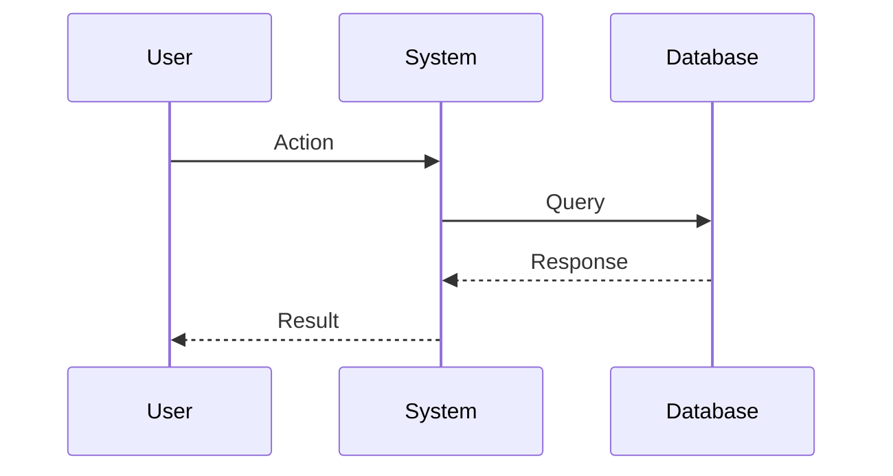
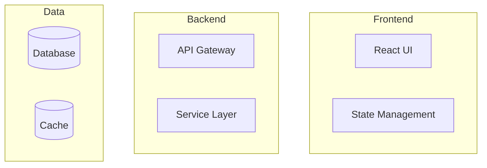
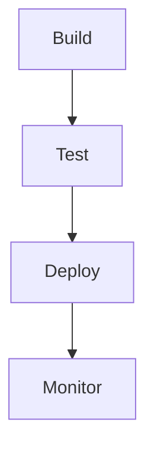

# Generator Usage Guide

## Overview
This guide explains how to use the documentation generators in sequence, including diagram generation at each step.

## Prerequisites
- Base documentation in `documentation/base/`
- Mermaid diagram support
- Access to generator prompts

## Step-by-Step Process

### 1. Requirements Generation

```bash
# Step 1: Generate Requirements Documentation
1. Copy content from create_requirements_prompt.md
2. Provide to AI agent
3. Agent will generate:
   - Use cases in documentation/generated/requirements/use_cases/
   - Matrices in documentation/generated/requirements/matrices/
   - Diagrams in documentation/generated/requirements/diagrams/
     - User flows
     - Entity relationships
     - Context diagrams
```

### 2. Technical Specification Generation

```bash
# Step 2: Generate Technical Documentation
1. Copy content from create_technical_prompt.md
2. Provide to AI agent
3. Agent will generate:
   - Technical specs in documentation/generated/technical/specs/
   - Architecture diagrams in documentation/generated/technical/diagrams/
     - System architecture
     - Component diagrams
     - Sequence diagrams
```

### 3. Implementation Prompt Generation

```bash
# Step 3: Generate Implementation Prompts
1. Copy content from create_prompts_prompt.md
2. Provide to AI agent
3. Agent will generate:
   - Implementation prompts in documentation/generated/prompts/implementation/
   - Implementation diagrams in documentation/generated/prompts/implementation/diagrams/
     - Setup flows
     - Implementation flows
     - Deployment flows
```

## Diagram Generation

### Requirements Diagrams
```markdown
# Example: User Flow Diagram

```

### Technical Diagrams
```markdown
# Example: Architecture Diagram

```

### Implementation Diagrams
```markdown
# Example: Deployment Flow

```

## Validation Steps

### 1. Requirements Validation
- [ ] All use cases documented
- [ ] All flows diagrammed
- [ ] All matrices complete

### 2. Technical Validation
- [ ] All components specified
- [ ] All interactions diagrammed
- [ ] All interfaces defined

### 3. Implementation Validation
- [ ] All prompts generated
- [ ] All flows diagrammed
- [ ] All steps documented

## Tips & Best Practices

1. **Diagram Standards**
   - Use consistent styling
   - Follow naming conventions
   - Include clear labels

2. **Documentation Structure**
   - Maintain hierarchy
   - Use cross-references
   - Keep related items together

3. **Generation Process**
   - Follow sequence
   - Validate each step
   - Update tracking

## Troubleshooting

### Common Issues
1. Missing diagrams
   - Check generator output
   - Verify diagram syntax
   - Update templates

2. Incomplete generation
   - Verify input content
   - Check dependencies
   - Update metadata

3. Inconsistent styling
   - Review style guide
   - Update templates
   - Fix formatting

## Next Steps

1. **Start Generation**
   - Review base documentation
   - Prepare generator inputs
   - Follow sequence

2. **Validate Output**
   - Check completeness
   - Verify diagrams
   - Test links

3. **Maintain Documentation**
   - Update as needed
   - Keep diagrams current
   - Track changes 